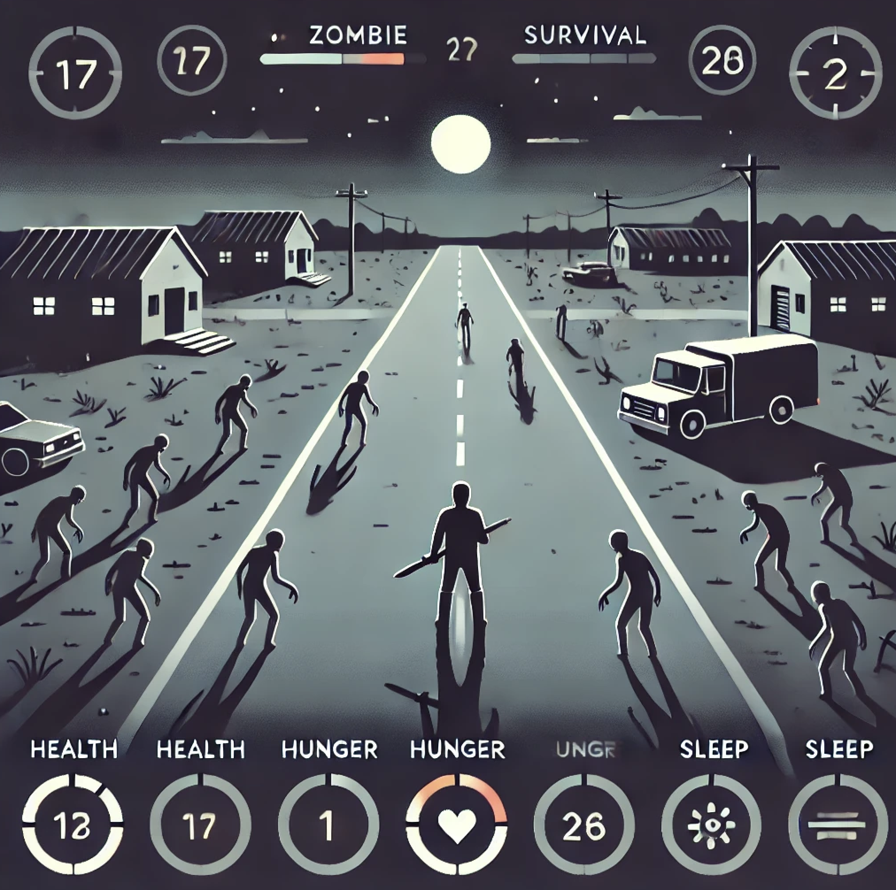

# 좀비 생존 게임

## 소개

**좀비 생존 게임**은 플레이어가 좀비로 가득 찬 세계에서 생존을 위해 싸우는 액션 어드벤처 게임입니다. 다양한 난이도와 풍부한 게임 메커니즘을 통해 몰입감 있는 생존 경험을 제공합니다. 생존자 보호 구역에 도달하는 것이 최종 목표이며, 그 과정에서 무기를 획득하고, 자원을 관리하며, 날씨 변화와 낮밤 주기를 극복해야 합니다.

## 주요 특징

- **난이도 선택**: 쉬움, 보통, 어려움 중 선택하여 다양한 난이도의 도전을 즐길 수 있습니다.
- **풍부한 HUD**: 체력, 배고픔, 수면, 시간, 무기, 맵 좌표, 레벨, 경험치 등을 한눈에 확인할 수 있습니다.
- **인벤토리 시스템**: 무기 및 아이템을 수집하고 관리할 수 있는 인벤토리 기능을 제공합니다.
- **다양한 좀비 유형**: 표준 좀비, 빠른 좀비, 탱크 좀비, 원거리 좀비 등 다양한 유형의 적들과의 전투를 경험할 수 있습니다.
- **레벨 및 경험치 시스템**: 경험치를 획득하여 레벨을 올리고 플레이어의 능력을 향상시킬 수 있습니다.
- **날씨 및 낮밤 주기**: 비, 눈 등 날씨 변화와 낮밤 전환이 게임 플레이에 영향을 미칩니다.
- **맵 생성 및 생존자 보호 구역**: 매번 새롭게 생성되는 맵에서 생존자 보호 구역을 찾아야 합니다.
- **무기 시스템**: 칼, 총 등 다양한 무기를 획득하고 사용하여 좀비를 사냥할 수 있습니다.
- **소리 효과 및 배경 음악**: 몰입감을 높여주는 사운드 효과와 배경 음악이 포함되어 있습니다.

## 설치 및 실행

### 요구 사항

- 최신 웹 브라우저 (Chrome, Firefox, Edge 등)
- 인터넷 연결 (사운드 및 이미지 자산 로딩을 위해 필요할 수 있음)

# 게임 플레이 방법

## 게임 시작

1. **난이도 선택**: 게임 시작 화면에서 원하는 난이도(쉬움, 보통, 어려움)를 선택합니다.
2. **게임 시작**: “게임 시작” 버튼을 클릭하여 게임을 시작합니다.

## 컨트롤

- **이동**: `W`, `A`, `S`, `D` 키 또는 방향키 (`↑`, `←`, `↓`, `→`)를 사용하여 플레이어를 이동시킵니다.
- **공격**: 스페이스바를 눌러 현재 장착된 무기로 공격합니다.
- **무기 장착**: 인벤토리 목록에서 무기를 클릭하거나 숫자 키 (`1~9`)를 눌러 무기를 장착합니다.

## 목표

- **생존자 보호 구역 도달**: 생존자 보호 구역의 좌표를 찾아 도달하는 것이 최종 목표입니다.
- **자원 관리**: 배고픔과 수면을 관리하며, 체력을 유지해야 합니다.
- **무기 및 아이템 수집**: 무기, 음식, 침대, 지도 아이템 등을 수집하여 생존 확률을 높입니다.
- **좀비 처치**: 다양한 유형의 좀비를 처치하여 경험치를 획득하고 레벨을 올립니다.

## 게임 오버 조건

- **체력 0 도달**: 플레이어의 체력이 0이 되면 게임 오버입니다.
- **배고픔 또는 수면 부족**: 배고픔 또는 수면 수치가 0이 되면 게임 오버입니다.
- **생존자 보호 구역 도달 실패**: 생존자 보호 구역에 도달하지 못하면 게임 오버입니다.

## 승리 조건

- **생존자 보호 구역 도착**: 생존자 보호 구역에 도착하면 게임을 클리어하게 됩니다.

# 게임 요소 설명

## HUD (Head-Up Display)

- **체력 (Health)**: 플레이어의 현재 체력을 표시합니다.
- **배고픔 (Hunger)**: 배고픔 수치를 관리하여 음식 섭취가 필요합니다.
- **수면 (Sleep)**: 수면 수치를 관리하여 플레이어의 피로를 관리합니다.
- **시간 (Time)**: 현재 낮 또는 밤을 표시합니다.
- **무기 (Weapon)**: 현재 장착된 무기를 표시합니다.
- **맵 좌표 (Map Coordinates)**: 현재 맵의 `X`, `Y` 좌표를 표시합니다.
- **레벨 (Level)**: 플레이어의 현재 레벨을 표시합니다.
- **경험치 (Experience)**: 레벨업을 위한 경험치를 표시합니다.

## 인벤토리

- **무기 관리**: 수집한 무기를 인벤토리에 보관하고 필요 시 장착할 수 있습니다.
- **아이템 관리**: 음식, 지도 아이템 등 다양한 아이템을 인벤토리에 보관할 수 있습니다.

## 좀비 유형

- **표준 좀비 (Standard)**: 기본적인 공격력을 가진 좀비.
- **빠른 좀비 (Fast)**: 이동 속도가 빠른 좀비.
- **탱크 좀비 (Tank)**: 높은 체력을 가진 좀비.
- **원거리 좀비 (Ranged)**: 원거리 공격이 가능한 좀비.

## 무기

- **칼 (Knife)**: 근접 공격 무기로, 빠르게 여러 적을 공격할 수 있습니다.
- **총 (Gun)**: 원거리 공격 무기로, 강력한 데미지를 줄 수 있습니다.

## 날씨 및 낮밤 주기

- **날씨**: 비, 눈, 맑음 등 다양한 날씨가 게임 플레이에 영향을 미칩니다. 예를 들어, 비가 오면 이동 속도가 감소합니다.
- **낮밤 주기**: 낮과 밤이 번갈아가며 전환되며, 밤에는 좀비가 더 많이 출몰합니다.

## 맵 생성

- **랜덤 맵 생성**: 매번 새롭게 생성되는 맵에서 다양한 건물과 도로, 방을 탐험할 수 있습니다.
- **생존자 보호 구역**: 랜덤하게 배치된 생존자 보호 구역의 좌표를 찾아 도달해야 합니다.

# 개발자 노트

## 기술 스택

- **HTML5**: 게임의 구조와 레이아웃을 담당합니다.
- **CSS3**: 게임의 스타일링과 레이아웃을 담당합니다.
- **JavaScript (ES6)**: 게임 로직, 인터랙션, 애니메이션 등을 구현합니다.
- **Canvas API**: 게임 그래픽을 그리는 데 사용됩니다.

## 자산

- **이미지**: 플레이어, 좀비, 무기, 아이템 등의 이미지 자산이 `assets/images/` 디렉토리에 저장되어 있습니다.
- **사운드**: 배경 음악 및 효과음은 `assets/sounds/` 디렉토리에 저장되어 있습니다.

## 이미지 및 사운드 로딩

모든 이미지와 사운드는 게임 시작 전에 로드되며, 로드가 완료되면 게임 시작 버튼이 활성화됩니다. 이미지 로드 실패 시 콘솔에 에러가 출력됩니다.

## 게임 루프

`requestAnimationFrame`을 사용하여 부드러운 애니메이션과 게임 상태 업데이트를 구현하였습니다. 게임 루프에서는 플레이어 이동, 충돌 체크, 상태 업데이트, 날씨 적용, 오브젝트 그리기 등을 처리합니다.

## 난이도 설정

난이도에 따라 플레이어의 속도, 좀비의 속도 및 체력이 조정됩니다. 난이도가 높을수록 좀비가 강력해지고 플레이어가 더 많은 도전을 겪게 됩니다.

## 기여 방법

기여를 환영합니다! 버그 수정, 기능 추가, 개선 사항 제안 등을 통해 프로젝트에 기여할 수 있습니다.

1. **저장소 포크하기**
2. **브랜치 생성하기** (`git checkout -b feature/새로운-기능`)
3. **변경 사항 커밋하기** (`git commit -m '새로운 기능 추가'`)
4. **브랜치 푸시하기** (`git push origin feature/새로운-기능`)
5. **풀 리퀘스트 생성하기**

## 라이선스

이 프로젝트는 MIT 라이선스를 따릅니다. 자세한 내용은 `LICENSE` 파일을 참고하세요.